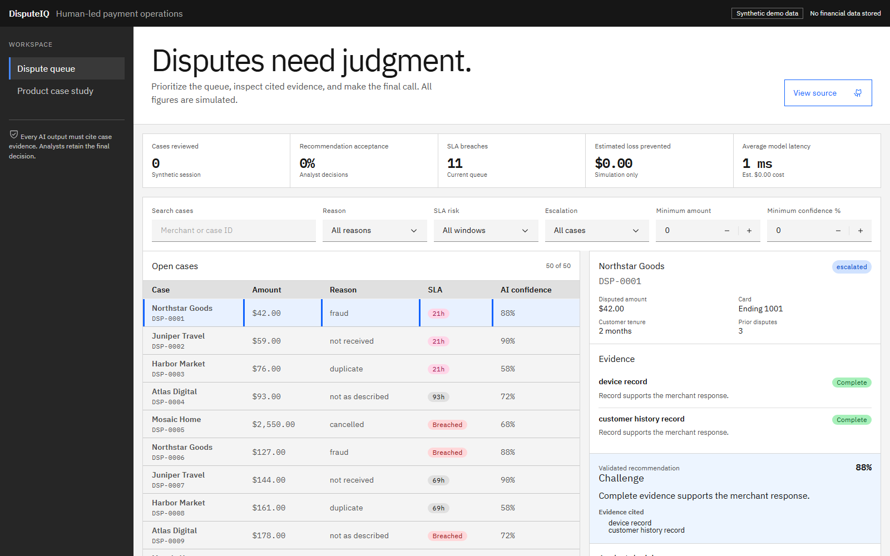
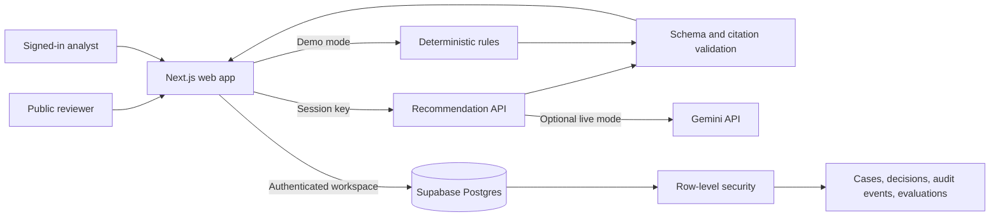

# DisputeIQ

DisputeIQ is a portfolio product for payment dispute triage. It helps an analyst move from a noisy queue to an evidence-backed decision while preserving the human judgment, citations, and audit history that financial operations require.

> **Portfolio disclaimer:** Every case, person, transaction, and metric in this project is synthetic. DisputeIQ is not connected to a payment network and does not claim production or customer outcomes.

## Try it

- **Live demo:** [disputeiq-five.vercel.app](https://disputeiq-five.vercel.app)
- **Demo mode:** No account or API key required
- **Interactive workspace:** GitHub sign-in and a configured Supabase project required
- **Optional AI mode:** Provide a Gemini API key for the current browser session. The key is never persisted or logged by the application.

Demo mode is deterministic, so reviewers can explore the workflow without credentials, usage costs, or model availability.

## Product preview



[Watch the 20-second analyst workflow](public/disputeiq-demo.webm)

## The problem

Dispute analysts must balance speed, loss prevention, evidence quality, and policy compliance. A confident recommendation is not useful if the analyst cannot trace it to evidence, challenge it, or explain the final decision later.

DisputeIQ treats AI as decision support, not an autonomous adjudicator:

1. Prioritize cases by SLA risk, amount, reason, confidence, and escalation status.
2. Review transaction context and cited evidence before seeing a recommendation.
3. Accept or override the recommendation, with a required reason for every override.
4. Preserve actions in an append-only audit timeline.
5. Evaluate recommendation quality, latency, and estimated cost on a synthetic benchmark.

## Five-minute walkthrough

1. Open the seeded queue and filter for high SLA risk.
2. Select a dispute, then inspect its transaction context and evidence.
3. Generate a deterministic recommendation and verify its citations, missing evidence, confidence, and risk flags.
4. Confirm it or choose a different disposition and record an override reason.
5. Review the audit timeline, then open the dashboard to see synthetic metrics update.
6. Optional: add a Gemini key for the browser session and compare live AI output with the deterministic baseline.

The full narration is in [docs/DEMO_SCRIPT.md](docs/DEMO_SCRIPT.md).

## Architecture



See [docs/ARCHITECTURE.md](docs/ARCHITECTURE.md) for trust boundaries, data flow, and scale-up notes.

## Local setup

Requirements: Node.js 20 or newer, npm, and optionally a free Supabase project.

```bash
npm install
npm run dev
```

Open `http://localhost:3000`. Demo mode must work without environment variables.

For authenticated workspaces, create a Supabase project, enable GitHub OAuth, and use the public project URL and anonymous key. Keep service-role and Gemini keys out of committed files.

## Quality checks

```bash
npm run lint
npm test
npm run build
```

Use `npm run` to confirm the implemented scripts. The acceptance bar is a clean build, credential-free demo access, isolated authenticated data, accessible core flows, validated recommendations, and no secrets or real financial data in the repository.

## What this demonstrates

- Product judgment: one polished analyst workflow instead of a simulated payment platform
- AI reliability: deterministic fallback, structured validation, citations, and explicit failure handling
- Governance: human confirmation, override reasons, auditability, synthetic data, and workspace isolation
- Evaluation: benchmark accuracy, risk flags, latency, and estimated unit cost reported as simulated results
- Deployment readiness: Next.js, TypeScript, Supabase row-level security, and free-tier Vercel hosting

Read the [product case study](docs/CASE_STUDY.md) for the rationale, assumptions, metrics, and roadmap.

## Scope

This MVP intentionally excludes real financial data, payment-network integrations, automated case resolution, background queues, streaming systems, microservices, and paid observability. Add them only after real demand, security review, and workload measurements justify them.

## License

Add a license before accepting external contributions or reuse.
