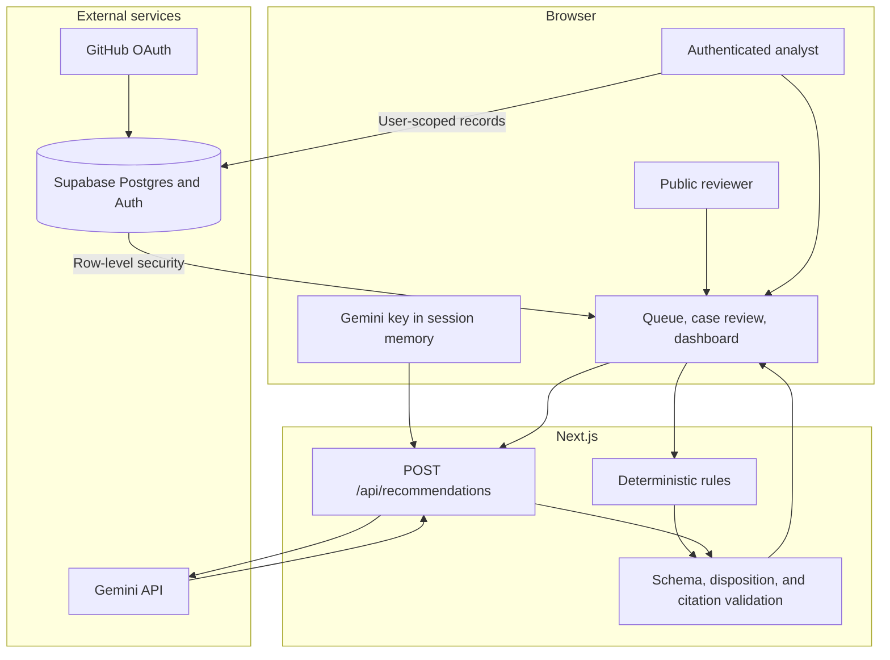

# Architecture

DisputeIQ is a single Next.js application with Supabase for optional authenticated persistence and Gemini for optional live recommendations. The public demo remains usable without either service.

## Data flow

1. Public demo data is loaded for read-only exploration.
2. A request includes dispute facts and selected evidence identifiers.
3. Demo mode applies deterministic rules. Live mode calls Gemini with the session-only key.
4. Every response passes structural, disposition, and citation validation before display.
5. The analyst confirms or overrides it. An override requires a reason.
6. Authenticated decisions and audit events are written under the current user and protected by row-level security.
7. Evaluation runs compare outputs with the 50-case synthetic benchmark.

## Core records

- `disputes`: synthetic case and transaction context
- `evidence`: case-linked evidence available for citation
- `recommendations`: validated model or deterministic output
- `decisions`: analyst-confirmed disposition and optional required override reason
- `audit_events`: append-only record of meaningful actions
- `evaluation_runs`: benchmark results, latency, and estimated cost

## Trust boundaries

- The browser owns the optional Gemini key only for the session.
- The API treats model output as untrusted input and validates it before use.
- Supabase policies, not client filtering, enforce workspace isolation.
- Public demo mode must not expose write access.
- No component accepts or stores real financial information.

## Deployment and scale

The intended free-tier deployment is one Vercel project and one Supabase project. Demo mode provides a useful degraded experience if Supabase or Gemini is not configured.

Keep the single application until measurements justify more infrastructure. Add background work only when latency exceeds the interactive budget, durable queues only when retries must survive request failures, and service separation only when independent ownership or scaling becomes a demonstrated constraint.
